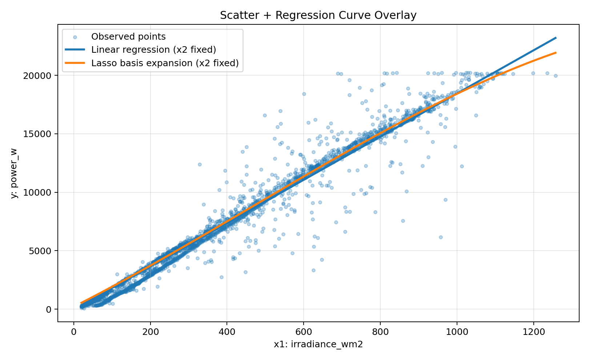
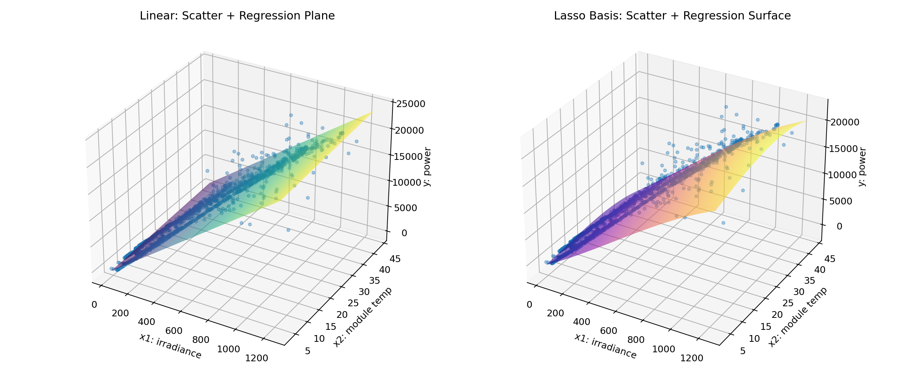

# グループワーク課題まとめ（ラッソ正則化を利用した基底展開法）

## 課題
3.（グループワーク）ラッソ正則化を利用した基底展開法の実習について以下の内容を報告する。
- a. 利用したデータに関して報告する。
- b. 散布図と回帰曲線（面）を重ねてプロットし，比較検討を行う。

---

## 1. 本実習で使用したデータ（3変数のみ）
本実習では、以下の3変数のみを使用した。
- 目的変数 y: power_w [W]
- 説明変数 x1: irradiance_wm2 [W/m^2]
- 説明変数 x2: module_temp_c [degC]

使用ファイル:
- data/solar_dataset_3vars.csv

このCSVは、FMI（Finnish Meteorological Institute）の公開PV実測データから上記3列だけを抽出して作成した。

抽出コマンド（PowerShell）:
```powershell
python build_fmi_solar_dataset.py
```

---

## 2. a. 利用データの報告

### 2.1 元データの取得元
- 元データ取得元: Finnish Meteorological Institute (FMI)
- データ公開ページ: https://fmi.b2share.csc.fi/records/fyyw1-16e65
- 元CSV: FMI_Helsinki_PV.csv
- ライセンス: Creative Commons Attribution 4.0 International (CC BY 4.0)

### 2.2 データ作成の流れ
1. FMI公開データ `FMI_Helsinki_PV.csv` から実測PVデータを取得
2. `build_fmi_solar_dataset.py` で `data/solar_dataset.csv` を生成
3. `data/solar_dataset.csv` から3列（power_w, irradiance_wm2, module_temp_c）のみ抽出して `data/solar_dataset_3vars.csv` を作成

### 2.3 期間・件数・サンプリング間隔
- データ期間（何日から何日まで）: 2016-06-10 から 2016-06-13
- タイムスタンプ範囲: 2016-06-10 10:56:00 〜 2016-06-13 03:35:00
- 行数:
  - data/solar_dataset.csv: 2631
  - data/solar_dataset_3vars.csv: 2631
- サンプリング間隔（中央値）: 1.0 分

### 2.4 変数の意味
- power_w: 発電電力 [W]（FMI `pv_inv_out`: 実測インバータAC出力）
- irradiance_wm2: 日射強度 [W/m^2]（FMI `GLOBA_PT1M_AVG(:31)`: 実測PV面日射）
- module_temp_c: モジュール温度 [degC]（FMI `TTECH_PT1M_AVG(:32)` と `TTECH_PT1M_AVG(:33)` の平均）

### 2.5 実測値について
`data/solar_dataset_3vars.csv` の3変数は、すべてFMI公開データの実測値由来である。
`power_w` は推定値ではなく、インバータ出力 `pv_inv_out` を用いた。

### 2.6 元データ由来の再現確認（検証）
`build_fmi_solar_dataset.py` を実行すると、FMI公開CSVから同じ形式の `data/solar_dataset.csv` と `data/solar_dataset_3vars.csv` を再生成できる。
作成時確認では、3変数に欠損値がないことを確認した。

---

## 3. b. 散布図と回帰曲線（面）の重ね描き・比較

### 3.1 モデル設定
比較したモデル:
- モデル1: 線形回帰（x1, x2）
- モデル2: 基底展開（3次多項式）+ LassoCV

設定値:
- 基底次数: 3
- Lasso 最適 alpha: 0.0840175

### 3.2 図（重ね描き）
図1: 散布図 + 回帰曲線（x2固定）



図2: 3次元散布図 + 回帰面（左: 線形, 右: ラッソ基底展開）



### 3.3 定量比較（テストデータ）
- 線形回帰: RMSE=1200.4956, R^2=0.9559
- ラッソ基底展開: RMSE=1188.8272, R^2=0.9568

### 3.4 比較検討
- 線形回帰は大域的な傾向は捉えられるが、非線形性の表現に限界がある。
- 基底展開 + Lasso は非線形な関係を表現しつつ、不要項を0に収縮してモデルを簡潔化できる。
- 本データでは、RMSE と R^2 の両方でラッソ基底展開モデルが良好な結果を示した。

---

## 4. 参考ファイル（作業根拠）
- data/solar_dataset_3vars.csv
- data/solar_dataset.csv
- build_fmi_solar_dataset.py
- groupwork03_lasso_report.md
- figures/groupwork03_scatter_curve_x1.png
- figures/groupwork03_scatter_surface_compare.png

---

## 5. 提出用の短い結論
本グループワークでは、太陽光発電データの3変数（y=power_w, x1=irradiance_wm2, x2=module_temp_c）を用いて、ラッソ正則化付き基底展開法の有効性を検証した。データは FMI（Finnish Meteorological Institute）が公開する Helsinki Kumpula の太陽光発電実測データから作成したものである。power_w は実測インバータAC出力、irradiance_wm2 は実測PV面日射、module_temp_c は実測モジュール温度の平均値である。散布図と回帰曲線・回帰面の比較、およびテストデータでの指標比較（RMSE, R^2）から、線形回帰よりラッソ基底展開のほうがわずかに良好な結果を示した。